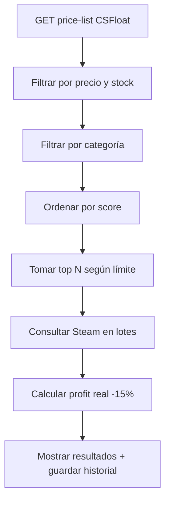
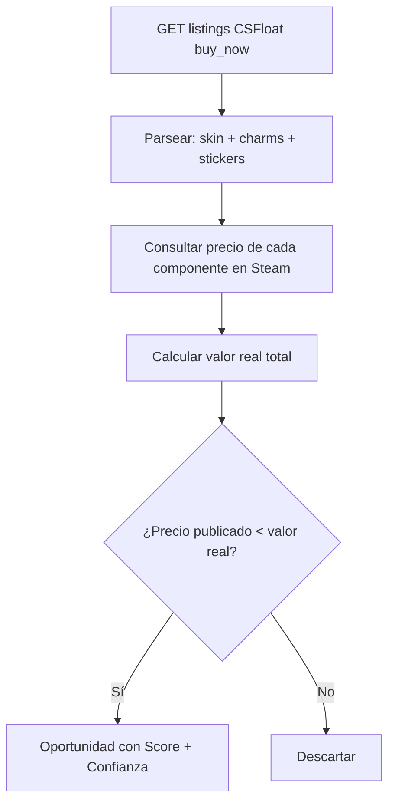
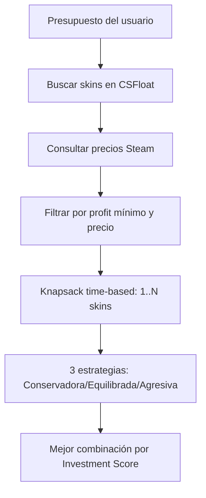

# 🏛️ SaintProfit — Arbitraje CS2 entre CSFloat y Steam Market

> 🌐 **Sitio web de documentación:** [saintprofit — GitHub Pages](https://marianojsc21.github.io/cs-arbitrage-extension/) — guía visual de los 3 modos, instalación paso a paso y preguntas frecuentes, pensada para usuarios no técnicos.
>
> ⚙️ **Para activar el sitio:** Repo Settings → Pages → **Deploy from a branch** → `main` → carpeta **`/docs`** → Save. El sitio vive en `docs/index.html`; las capturas de los modos son mockups CSS que podés reemplazar por screenshots reales (guarda las imágenes en `docs/assets/`).

**SaintProfit** (v3.10.2) es una extensión de navegador (Brave/Chrome) que detecta **oportunidades de arbitraje** entre **CSFloat** y **Steam Market** para artículos de Counter-Strike 2 (CS2).

Analiza **skins, cuchillos, guantes, pegatinas, cajas, agentes, llaveros, parches, lotes de música, coleccionables y graffiti**, calculando el profit real descontando las comisiones de cada mercado (15% Steam, 2% CSFloat).

Incluye **3 motores**: **SteamFarm** (profit CSFloat → Steam), **Smart Invest** (optimización de cartera tipo Knapsack) y **Market Sniper** (detección de publicaciones mal valoradas, charms y stickers).

---

## 📋 Tabla de Contenidos

- [Características](#-características)
- [Estructura del Proyecto](#-estructura-del-proyecto)
- [Instalación](#-instalación)
- [Uso](#-uso)
- [Modos](#-modos)
- [Market Sniper — Motores de Búsqueda](#-market-sniper--motores-de-búsqueda)
- [Alertas Steam Sniper](#-alertas-steam-sniper)
- [Flujo de Escaneo](#-flujo-de-escaneo)
- [API y Fuentes de Datos](#-api-y-fuentes-de-datos)
- [Cálculo de Profit](#-cálculo-de-profit)
- [Oportunidad Score y Confidence Score](#-oportunidad-score-y-confidence-score)
- [Historial de Búsquedas](#-historial-de-búsquedas)
- [Filtros](#-filtros)
- [Temas](#-temas)
- [Content Script (Badges en CSFloat)](#-content-script-badges-en-csfloat)
- [Actualizaciones](#-actualizaciones)
- [Solución de Problemas](#-solución-de-problemas)
- [Versiones](#-versiones)
- [Diseño](#-diseño)
- [Licencia](#-licencia)

---

## 🚀 Características

| Característica | Descripción |
|---|---|
| **3 Modos** | SteamFarm (profit) · Smart Invest (cartera) · Market Sniper (oportunidades) |
| **Escaneo Inteligente** | Obtiene items de CSFloat/Steam y los filtra antes de calcular profit |
| **12 Categorías** | Skins, Cuchillos, Guantes, Pegatinas, Cajas, Agentes, Llaveros, Parches, Música, Coleccionables, Graffiti |
| **Profit Real** | Descuenta comisiones de ambos mercados (Steam 15%, CSFloat 2%) |
| **Market Sniper** | Detecta skins mal valoradas + arbitraje de charms y stickers |
| **2 Botones de Escaneo** | Sniper: botón CSFloat 🟠 y botón Steam 🟦, motores independientes |
| **Alerta Steam Sniper** | Overlay rojo + notificación del sistema si hay cuchillos/guantes < $20 |
| **Auto-scan en vivo** | Sniper chequea Steam automáticamente cada 45s mientras está activo |
| **Knapsack Optimizer** | Smart Invest evalúa combinaciones de 1 a N skins con límite de tiempo |
| **Investment Score** | Puntaje propio: profit + liquidez + volumen + velocidad − riesgo |
| **Confidence Score** | Qué tan confiable es el valor calculado (volumen, componentes) |
| **Top Opportunities** | Ranking de mejores oportunidades del día por Investment Score |
| **Calculadora Compuesta** | Simulador de capitalización (capital inicial, profit medio, operaciones) |
| **Historial Persistente** | localStorage + chrome.storage.local (dual-write, sobrevive reinstalaciones) |
| **Top 7 Histórico** | Mejores oportunidades de todos los escaneos por cada modo |
| **Detener Escaneo** | Botón para detener la búsqueda sin perder resultados parciales |
| **Links Directos** | Cada item con link a CSFloat y a Steam Market |
| **Tabla Ordenable** | Clic en columnas para ordenar ascendente/descendente |
| **3 Temas** | Amber (default), Blanco (claro con rojo), Night (ultra-dark) |
| **Badges en CSFloat** | Content script que muestra badges de profit en csfloat.com |
| **Auto-Update** | Verificación de actualizaciones desde GitHub |
| **Glow Dinámico** | Columna activa con glow naranja, inactiva con glow violeta |
| **Transiciones Suaves** | Animaciones de slide, fade y pulse en columnas y filtros |

---

## 📁 Estructura del Proyecto

```
saintprofit/
├── manifest.json           # Configuración de la extensión (Manifest V3)
├── manifest.chrome.json    # Variante para Chrome
├── app.html                # Página principal (SPA con CSS embebido)
├── popup.html              # Popup minimalista con selector de modos
├── README.md               # Esta documentación
├── .gitignore              # Archivos ignorados por git
├── icons/
│   ├── icon16.png          # Icono 16px (tab / favicon)
│   ├── icon48.png          # Icono 48px
│   ├── icon128.png         # Icono 128px (notificaciones)
│   ├── icon256.png         # Logo para el header de app.html
│   ├── brand-header.jpeg   # Lettering SaintProfit
│   ├── lettering.png       # Lettering grande
│   ├── lettering-small.png # Lettering para popup
│   ├── csfloat-link.png    # Icono de link/botón a CSFloat
│   └── steam-link.webp     # Icono de link/botón a Steam
├── css/
│   └── styles.css          # Estilos para badges en CSFloat
└── js/
    ├── app.js              # SteamFarm: UI, APIs, historial, renderizado
    ├── smart-invest.js     # Smart Invest Engine v2 (Portfolio Optimizer)
    ├── market-sniper.js    # Cross-Market Engine v2 (Market Sniper)
    ├── background.js       # Service worker: proxy, notificaciones, auto-update
    ├── content.js          # Content script para badges en CSFloat
    ├── init.js             # Mode switching, Top 7 histórico, temas
    ├── popup.js            # Lógica del popup (lee versión del manifest)
    ├── loader.js           # Cargador de archivos actualizados
    └── storage.js          # StorageHelper (localStorage + chrome.storage)
```

### 📄 Descripción de Archivos

| Archivo | Rol |
|---|---|
| **manifest.json** | Manifiesto MV3: permisos, host_permissions, CSP, service worker |
| **app.html** | Single-page application con CSS embebido y layout de columnas |
| **popup.html** | Popup minimalista con selector de modos |
| **js/app.js** | SteamFarm: escaneo, filtros, historial, render de tabla |
| **js/smart-invest.js** | Smart Invest Engine v2: Knapsack time-based, 3 estrategias, score |
| **js/market-sniper.js** | Cross-Market Engine v2: providers, valor real, charms/stickers, alertas |
| **js/init.js** | Mode switching, Top 7 histórico global, sistema de temas |
| **js/storage.js** | StorageHelper: dual-write localStorage + chrome.storage.local |
| **js/background.js** | Service worker: notificaciones, detección de actualizaciones |
| **js/content.js** | Inyectado en csfloat.com: badges de profit en listings |
| **css/styles.css** | Badges flotantes con animación para CSFloat |

---

## 🔧 Instalación

### Requisitos

- **Brave** o **Chrome** (versión actualizada)
- Conocimientos básicos de CSFloat y Steam Market

### Instalación Manual (Desarrollador)

1. **Descargá el proyecto**
   ```bash
   git clone https://github.com/marianojsc21/cs-arbitrage-extension.git
   cd cs-arbitrage-extension
   ```

2. **Cargá la extensión en Brave/Chrome**
   - Abrí `brave://extensions` o `chrome://extensions`
   - Activá **"Modo desarrollador"** (toggle superior derecho)
   - Clic en **"Cargar descomprimida"**
   - Seleccioná la carpeta del proyecto

3. **Listo** 🎉
   - Hacé clic en el icono de SaintProfit en la barra
   - Elegí un modo y comenzá a escanear

---

## 🎮 Uso

### Popup de la Extensión

1. Hacé clic en el icono de SaintProfit en la barra de herramientas
2. Elegí entre **SteamFarm**, **Smart Invest** o **Market Sniper**
3. Se abre la app en una nueva pestaña con el modo seleccionado (`app.html?mode=X`)

### Cambio de Modo

En la app, hacé clic en el **título del modo** o en la **tarjeta de filtros** correspondiente para intercambiar. El modo activo ocupa el espacio principal con glow naranja, los inactivos se minimizan con sus stats y Top 7 histórico.

También: hacer clic en el **logo** de SaintProfit (arriba a la izquierda) vuelve al modo **SteamFarm**.

---

## 🔄 Modos

### 💵 SteamFarm (profit)

Busca la **máxima diferencia** de precio donde CSFloat es barato y Steam es caro:

- **Compra en**: CSFloat · **Vende en**: Steam (con comisión del 15%)
- **Resultado**: Profit en Steam Wallet
- **Columnas**: Item | CSFloat | Steam (-15%) | Profit $ | Profit % | Vol. Steam | Stock
- **Score**: `quantity × (1 / min_price)` — prioriza items baratos con stock

### 🧠 Smart Invest

Optimiza tu **saldo disponible en Steam** para reinvertir de la forma más eficiente:

1. Ingresá tu **presupuesto** (ej: $37.52)
2. El motor busca skins en CSFloat, consulta precios en Steam
3. Resuelve un problema de **Knapsack time-based**: evalúa combinaciones de 1, 2, 3... N skins mientras no supere el límite de tiempo, siempre usando la mayor parte posible del saldo
4. Ofrece **3 estrategias**: 🟢 Conservadora (máxima liquidez), 🟡 Equilibrada (mejor relación riesgo/beneficio), 🔴 Agresiva (máximo profit)
5. Cada combinación muestra: Profit $, Profit %, ROI, ROD (retorno diario), Investment Score, Confidence, Liquidez ⭐, Riesgo

Incluye **Calculadora de Capitalización** (capital inicial × profit medio × operaciones) y **Top Opportunities Today**.

### 🎯 Market Sniper

Detecta **publicaciones mal valoradas** ("mispriced listings") que representan oportunidades de compra inmediata:

- **Valor real** de cada publicación = valor de la skin + charms + stickers (calculado con precios de mercado)
- **Charm Arbitrage**: si los charms equipados valen más que la skin, es una oportunidad (badge 🔑 Charm Dominant)
- **Sticker Arbitrage**: mismo análisis con stickers (Holo, Foil, Gold, Glitter, Crystal)
- **Skin Mispriced**: skins cuyo precio publicado está muy por debajo de su valor de mercado
- **Cross-Market**: compara Steam ↔ CSFloat y recomienda dónde comprar y dónde vender
- Cada oportunidad muestra: Precio publicado, Valor real, Breakdown (skin/charm/stickers), Profit neto, Opportunity Score, Confidence Score, Liquidez y estrategia óptima (vender completa vs separar componentes)

---

## 🎯 Market Sniper — Motores de Búsqueda

El modo Sniper tiene **2 botones de escaneo independientes**, cada uno con su propio motor:

| Botón | Origen | Qué hace |
|---|---|---|
| 🟠 **Escanear** (logo CSFloat) | CSFloat | Trae los últimos listings `buy_now` de CSFloat, calcula el valor real (skin + charms + stickers) y detecta oportunidades |
| 🟦 **Escanear** (logo Steam) | Steam | FASE 1: busca cuchillos/guantes < $20 en Steam (con alerta). FASE 2: busca items en Steam Market y los compara contra la price-list de CSFloat |

Solo el botón presionado cambia a "Detener" — el otro queda intacto.

> 💡 El botón **🔔** (junto al historial) activa/desactiva las alertas en tiempo real del Sniper. Cuando está activo, las oportunidades con Opportunity Score ≥ 70 generan una notificación inmediata mientras se escanea.

### Botón Steam — FASE 1: Cuchillos/Guantes < $20

1. Busca en Steam Market los items más baratos que empiecen con **★**
2. Si encuentra un **cuchillo o guante** por debajo del precio límite (default **$20**):
   - Muestra **overlay rojo** tapando toda la pantalla
   - Botón **🛒 COMPRA INMEDIATA** que abre el listing de Steam
   - Envía **notificación del sistema** (chrome.notifications)
3. Este chequeo también corre **automáticamente cada 45s** mientras el modo Sniper está activo — sin necesidad de apretar nada

### Botón Steam — FASE 2: Cross-Market en Steam

1. Obtiene la **price-list de CSFloat** (1 sola llamada liviana, ~27K items)
2. Busca en **Steam Market** con queries variadas (★, Sticker, Case, Souvenir, StatTrak, Gloves, Charm), ordenadas por **más vendidos**
3. Deduplica por `market_hash_name`
4. Por cada item, busca su precio en CSFloat y calcula el **profit cross-market**
5. Muestra oportunidades con Score, Confianza y Liquidez

---

## 🔪 Alertas Steam Sniper

Cuando el Sniper encuentra un cuchillo/guante < $20 (ya sea manual o por auto-scan):

```
┌──────────────────────────────────────┐
│  🔪 ¡SNIPER!                         │
│  Oportunidad detectada en Steam      │
│  ────────────────────────────────    │
│  🔪 Cuchillo                        │
│  ★ Gut Knife | Safari Mesh (WW)     │
│  Precio Steam: $18.50               │
│  Límite: $20                        │
│  ┌──────────────────────────────┐   │
│  │ 🛒 COMPRA INMEDIATA          │   │
│  └──────────────────────────────┘   │
│  ✕ Ignorar y cerrar                 │
└──────────────────────────────────────┘
```

Además se muestra un **toast** y una **notificación del sistema**:
> 🔪 ¡SNIPER! ★ Gut Knife | Safari Mesh — $18.50 en Steam!

El límite de precio se configura en el filtro **"Cuchillos/Guantes < $"** de la columna de filtros.

---

## 🔄 Flujo de Escaneo

### SteamFarm



### Market Sniper (CSFloat)



### Smart Invest



### Detalles Técnicos

| Aspecto | Detalle |
|---|---|
| **CSFloat API** | `/api/v1/listings/price-list` (sin auth) y `/api/v1/listings?limit=10&types=buy_now` (paginado con cursor) |
| **Steam API** | `priceoverview` para precios + `search/render` para búsquedas |
| **Rate Limiting** | Lotes de 10 items, 5-8s entre lotes, backoff exponencial 12s→45s, máx 5 retries |
| **Cache de Listings** | `getCachedListings()` con TTL de 2 min — compartido entre scans para no duplicar requests |
| **Cache de Precios** | 30 min para precios de Steam |
| **Timer** | ⏱️ `setInterval` con formato `M:SS`, se limpia en todos los exit paths |
| **Detención** | `scanning = false` interrumpe el loop en el siguiente lote |
| **Persistencia** | Resultados en localStorage + chrome.storage.local (dual-write) |
| **Auto-restauración** | Al recargar la página se restaura el último escaneo |

---

## 📡 API y Fuentes de Datos

### CSFloat API

```http
GET https://csfloat.com/api/v1/listings/price-list
```

Respuesta: Array de objetos con:
```json
{
  "market_hash_name": "AK-47 | Redline (Field-Tested)",
  "min_price": 1500,        // Precio mínimo en centavos USD
  "quantity": 42            // Cantidad en stock
}
```

Listings detallados (para charms/stickers):
```http
GET https://csfloat.com/api/v1/listings?limit=10&types=buy_now&cursor={cursor}
```

### Steam Market API

Precios:
```http
GET https://steamcommunity.com/market/priceoverview/
    ?appid=730&currency=1&market_hash_name={nombre}
```

Búsqueda:
```http
GET https://steamcommunity.com/market/search/render/
    ?query={q}&start=0&count=50&sort_column=quantity&sort_dir=desc&appid=730&norender=1
```

Headers anti-bloqueo:
```
Accept: application/json
User-Agent: Mozilla/5.0 (Windows NT 10.0; Win64; x64) AppleWebKit/537.36
Referer: https://steamcommunity.com/market/
Origin: https://steamcommunity.com
```

**Importante**: Solo se usa `lowest_price` (precio mínimo actual). NO se usa `median_price` porque para items de bajo volumen puede diferir mucho del precio real.

---

## 💰 Cálculo de Profit

### SteamFarm
```
steam_price_real = steam_lowest_price × 0.85   (descontando 15% comisión)
profit_usd = steam_price_real - csfloat_price
profit_percent = ((steam_price_real - csfloat_price) / csfloat_price) × 100
```

### Market Sniper — Valor Real
```
valor_skin    = precio promedio del mercado (Steam + CSFloat)
valor_charms  = Σ precio de cada charm en Steam
valor_stickers = Σ precio de cada sticker en Steam
valor_real    = valor_skin + valor_charms + valor_stickers

profit_neto_completo = valor_real × (1 - comisión mercado) - precio_publicado
profit_neto_separado = (skin×0.85 + charms×0.85 + stickers×0.85) - precio_publicado

Descuento % = ((valor_real - precio_publicado) / valor_real) × 100
```

### Ejemplo Charm Arbitrage

| Item | Valor | |
|---|---|---|
| USP-S (skin) | $2.10 | |
| Charm Baby Karat T | $1.65 | |
| **Valor real** | **$3.75** | |
| Precio publicado | $2.35 | |
| **Ganancia potencial** | **+$1.40** | 🟢 |

### Categorías Detectadas Automáticamente

| Categoría | Palabras Clave |
|---|---|
| 🎯 Skins | (default) |
| 🔪 Cuchillos | knife, bayonet, karambit, m9, gut, falchion, ★ |
| 🧤 Guantes | gloves, wrap |
| 🏷️ Pegatinas | sticker |
| 📦 Cajas | case, capsule, package |
| 👤 Agentes | agent, operator |
| 🔑 Llaveros | keychain, charm |
| 🪡 Parches | patch |
| 🎵 Música | music kit |
| 🎖️ Coleccionables | collectible, medal, coin |
| 🎨 Graffiti | graffiti |

---

## 📊 Oportunidad Score y Confidence Score

### Opportunity Score (0–100)

```
Score = descuento (máx 30) + profit neto (máx 25) + liquidez (15%)
      + bonus charms (máx 15) + bonus stickers (máx 10) + volumen (5)
      + bonus mispriced (15 directo / 10 cross-market)
      + bonus accesorios ≥30% (8) + bonus cross-market (5)

Penalizaciones no lineales:
  - profit < $1      → ×0.5
  - descuento > 70%  → ×0.6  (demasiado bueno para ser cierto)
  - confianza < 30   → ×0.5
```

### Confidence Score (0–100)

```
50% por volumen + 20% charms + 15% stickers + 15% volumen alto
-10 pts por cada componente con valor incierto (sin historial de ventas)
```

Los componentes sin historial se marcan como **"valor incierto"** (amarillo) y se reduce el Confidence Score — nunca se asigna un precio arbitrario.

### Liquidez ⭐

| Estrellas | Volumen 24h |
|---|---|
| ★★★★★ | > 1000 |
| ★★★★ | 500–1000 |
| ★★★ | 100–500 |
| ★★ | 10–100 |
| ★ | 1–10 |

---

## 📋 Historial de Búsquedas

Cada escaneo se guarda automáticamente con **dual-write** (`StorageHelper`): se escribe en `localStorage` y en `chrome.storage.local` — así sobrevive incluso a la reinstalación de la extensión.

### Storage Keys

| Modo | Key |
|---|---|
| SteamFarm | `saintprofit_history` |
| Smart Invest | `saintprofit_invest_history` |
| Market Sniper | `saintprofit_opportunity_history` |
| Tema | `saintprofit_theme` |
| Fees | `saintprofit_invest_fees` |

### Funcionalidades

| Acción | Cómo |
|---|---|
| **Ver historial** | Clic en 📋 **Historial** en la barra de controles del modo |
| **Restaurar escaneo** | Clic en cualquier entrada del historial → carga los resultados en la tabla con badge "📂 Historial: ..." |
| **Eliminar entrada** | Clic en ✕ en la entrada |
| **Borrar todo** | Clic en 🗑️ en el header del panel |
| **Top 7 Histórico** | Mejores items de TODOS los escaneos en la columna del modo inactivo |
| **Límite** | Máximo 20 entradas por modo (las más viejas se descartan) |

---

## 🎛️ Filtros

Los filtros están organizados en **tarjetas separadas** en la columna izquierda, una por cada modo. Solo se expande la del modo seleccionado; las demás quedan minimizadas. Funcionan **en vivo** sobre los resultados ya escaneados.

### SteamFarm

| Filtro | Tipo | Default | Opciones |
|---|---|---|---|
| **Categoría** | Select | Todas | Skins, Cuchillos, Guantes, etc. (12 opciones) |
| **Profit Mínimo** | Número | 10% | 1–999% |
| **Precio CSFloat** | Número | $3 – $50 | Mín y máx |
| **Límite** | Select | 50 | 15 / 30 / 50 / 100 / 200 |
| **🔥 Más Vend.** | Checkbox | off | Solo items con volumen en Steam |
| **Orden** | Select | Profit % ↓ | 9 opciones |

### Smart Invest

| Filtro | Tipo | Default | Opciones |
|---|---|---|---|
| **💰 Presupuesto** | Número | $37.52 | Tu saldo en Steam |
| **Categoría** | Select | Todas | 12 opciones |
| **Profit mín.** | Número | 5% | 0–999% |
| **Precio CSFloat** | Número | $1 – $500 | Mín y máx |
| **Límite** | Select | 50 | 50 / 100 / 200 |

### Market Sniper

| Filtro | Tipo | Default | Opciones |
|---|---|---|---|
| **Profit mín.** | Número | $2 | Profit neto mínimo en USD |
| **Desc. mín.** | Número | 10% | Descuento vs valor real |
| **Charm mín.** | Número | $0.50 | Valor mínimo de charms |
| **Sticker mín.** | Número | $0.30 | Valor mínimo de stickers |
| **Acc % mín.** | Número | 0% | Accesorios ≥ X% del valor total (0 = off) |
| **Límite** | Select | 30 | 30 / 60 / 90 / 120 |
| **🔪 Cuchillos/Guantes <** | Número | $20 | Límite para la alerta Steam Sniper |

---

## 🎨 Temas

Disponibles desde el footer (botón "Tema"):

| Tema | Descripción |
|---|---|
| **Amber** | Default: naranja + aqua + negro |
| **Blanco** | Claro con detalles rojos |
| **Night** | Ultra-dark con cuchillo Blue Gem |
| **Night** | Ultra-dark, aún más profundo |
| **Amber** | Cálido, tonos ámbar |

La selección persiste en localStorage y se aplica inmediatamente.

---

## 🏷️ Content Script (Badges en CSFloat)

Cuando navegás en `csfloat.com` con la extensión activa:

1. **Detección de listings**: Encuentra elementos de listings en la página
2. **Consulta a Steam**: Obtiene precio de Steam vía background.js
3. **Cálculo de profit**: Misma fórmula (×0.85)
4. **Badge flotante**: Muestra CSFloat, Steam y Ganancia con color según %
   - 🟢 Aqua ≥30% · 🟡 Amarillo ≥20% · 🟠 Naranja ≥10% · 🔴 Rojo <10%
5. **Indicador global**: Badge "SaintProfit: ON / OFF" con dot animado
6. **Batch Processing**: Listings procesados en lotes con stagger y delay entre lotes

---

## 🔄 Actualizaciones

El service worker (`js/background.js`) verifica actualizaciones cada hora desde GitHub:
```
https://raw.githubusercontent.com/marianojsc21/cs-arbitrage-extension/main/manifest.json
```

Si hay una versión más nueva, descarga los archivos actualizados y los almacena en `chrome.storage.local` (vía `js/loader.js`).

---

## 🔧 Solución de Problemas

### ❌ "CSFloat rate limit" / 429
**Causa**: Demasiadas consultas a CSFloat en poco tiempo.

**Solución**:
1. Esperá 30-60 segundos y reintentá
2. Bajá el límite de listings en los filtros del Sniper
3. El motor ya espera 5-8s entre lotes y hace backoff exponencial (hasta 45s) con 5 reintentos

### ❌ "CSFloat error: 400 - limit is too high"
**Causa**: El límite de items por request excede lo permitido.

**Solución**: Reducí el límite en los filtros. El motor usa lotes de 10 por request.

### ❌ "No se encontraron listados en CSFloat"
**Causa**: CSFloat cambió su API o hay rate limiting.

**Solución**:
1. Verificá que `https://csfloat.com` sea accesible
2. Esperá 30 segundos y reintentá

### ❌ "Extension context invalidated"
**Causa**: El service worker se recargó mientras el content script seguía activo.

**Solución**: Recargá la página de CSFloat. La extensión maneja este error gracefulmente.

### ❌ Error CSP en consola
**Causa**: Una extensión de terceros intenta inyectar un script en la página de SaintProfit.

**Solución**: Es **inofensivo** — la extensión funciona correctamente de todos modos. Ignorar.

### ❌ Steam no devuelve precios (priceoverview null)
**Causa**: Steam bloquea la IP temporalmente o el item no tiene listado activo.

**Solución**:
1. Esperá 1-2 minutos entre escaneos
2. Verificá que el item exista en `steamcommunity.com/market`
3. El motor maneja 429 con espera automática de 5s

---

## 📌 Versiones

| Versión | Cambios |
|---|---|
| **v3.10.2** | 🎨 **Temas**: dot del tema Amber refinado a naranja puro e intenso (#ff7a1a) |
| **v3.10.1** | 🎨 **Temas**: Amber naranja (default), tema SaintProfit eliminado, Blanco segundo en la lista |
| **v3.10.0** | 🎨 **Temas**: Amber pasa a ser el tema principal por defecto; el logo en Night ahora tiene el cuchillo estilo Blue Gem (azul); nuevo tema **Blanco** con detalles rojos |
| **v3.9.0** | 🛡️ **Anti rate-limit en Market Sniper**: listings de CSFloat se traen en páginas de 50 (4x menos requests), caché de listings de 10 min, polling de alertas cada 3 min, auto-scan de Steam cada 2 min, y cola con gap en el fetch de Steam del background + guard anti-concurrencia en el content script |
| **v3.8.5** | ⚖️ **Balance visual en columnas inactivas**: el Top 7 histórico ahora se distribuye a lo largo de todo el alto disponible (space-between) con items más aireados, para compensar las stats compactas y llenar el espacio vacío |
| **v3.8.4** | 🎯 **Top 7 histórico sin scroll**: se achican las stats de los modos inactivos (min-height 110→60px) y se compactan los items del Top 7 para que entre completo en la columna, eliminando el scroll interno |
| **v3.8.3** | 🎯 **Fix de layout**: las columnas de modos no seleccionados ya no se desbordan por debajo de los límites marcados (overflow contenido + scroll interno en el Top 7) |
| **v3.8.2** | 💾 **Caché de CSFloat persistente**: el price-list (~27k items) se guarda en `chrome.storage.local` (con `unlimitedStorage` para la cuota) y se carga al abrir la extensión — los precios sobreviven a recargas sin re-descargar |
| **v3.8.1** | 🧹 **Limpieza de fallbacks muertos de CSFloat**: eliminados los fetches directos a `price-list`/`listings` de app.js, smart-invest.js y market-sniper.js (y sus constantes `CSFLOAT_API`/`CSFLOAT_LISTINGS_API`/`CSFLOAT_PRICE_API`) — los 3 modos usan exclusivamente `CSFloatClient` (key + caché + cola + puente de sesión) |
| **v3.8.0** | 💾 **Caché de Steam persistente**: los precios de `SteamClient` se guardan en `chrome.storage.local` (máx. 3000 items, debounce 2s) y se cargan al abrir la extensión — los precios sobreviven a recargas sin re-consultar a Steam |
| **v3.7.9** | 🧹 **Limpieza de fallbacks muertos de Steam**: eliminadas las cachés locales duplicadas (`steamCache` en app.js y smart-invest.js, `priceCache` en market-sniper.js) y sus fetches directos a priceoverview — los 3 modos usan exclusivamente `SteamClient` (caché compartida + cola global + backoff) |
| **v3.7.8** | 🗂️ **Auto-apertura de csfloat.com**: si al escanear no hay ninguna pestaña de csfloat.com abierta, la extensión la abre automáticamente en segundo plano (active:false), avisa en la UI y espera a que el content script esté listo — adiós al 403 de sesión manual |
| **v3.7.7** | 🗄️ **Indicador de estado de la caché de CSFloat** en la UI: muestra hace cuánto se descargó el price-list ("Precios de hace X min — escaneá de nuevo para refrescar") + botón 🔄 para forzar el refresh manual |
| **v3.7.6** | 🛡️ **Cliente centralizado de Steam** (`js/steam.js`): caché compartida de priceoverview (30 min) entre los 3 modos + cola global anti-ráfaga (1 request / 1s) + retry backoff en 429 + variantes de stickers — los modos ya no re-consultan los mismos items entre sí ni disparan ráfagas que Steam corta con 429 |
| **v3.7.5** | 🔓 Fix Market Sniper "Listings 0/0": la API de listings de CSFloat ahora exige sesión logueada (403). El escaneo ahora usa el **content script en csfloat.com** como puente de sesión (fetch same-origin con tus cookies) y cae al fetch directo si no hay pestaña abierta — con mensaje claro en pantalla en vez de un 0/0 silencioso |
| **v3.7.4** | 🚦 Nuevo **cliente centralizado de CSFloat** (`js/csfloat.js`): usa la API key del usuario (`Authorization: Bearer`) + caché compartida del price-list (30 min) + cola global anti-bloqueo (1 request / 1.1s) con retry backoff en 429 — los 3 modos dejan de disparar ráfagas que provocan "too many requests from too many IPs" |
| **v3.7.3** | 🎯 Market Sniper: Fase 2 del escaneo Steam reescrita como **Charm Arbitrage** — busca skins con charms/stickers equipados y detecta dónde conviene comprar skin+charm baratos para venderlos **por separado en Steam** (badge ⭐ cuando el charm vale más que la skin) · Sin búsquedas vacías de 1 segundo |
| **v3.7.2** | 📤 Exportar/Importar historial de los 3 modos como JSON (backup y migración entre dispositivos) · Nuevo módulo js/history-io.js · Botones ⬇️/⬆️ en cada panel de historial · 🌐 Sitio web de documentación en GitHub Pages (docs/) |
| **v3.7.1** | 🔢 Auto-update con comparación semántica de versiones (arregla 3.10.0 vs 3.9.0) · 🆕 Badge "Nueva versión disponible" en la app · FILES_TO_UPDATE completado con todos los JS |
| **v3.7.0** | 📚 README actualizado · Limpieza de Capitallet (modo y filtros) · Botones de escaneo independientes en Sniper (CSFloat/Steam) · Motor Steam con FASE 1 (cuchillos/guantes < $20 con alerta) + FASE 2 (cross-market desde Steam) · Filtro estricto de charms dominantes · Rate limiting reforzado (cache compartido, lotes de 10, backoff 12s→45s, 5 retries) |
| **v3.6.x** | Botones de escaneo separados por mercado en Sniper · Alertas Steam Sniper (overlay rojo + notificación) · Auto-scan de cuchillos/guantes cada 45s · Cache de listings compartido |
| **v3.5.0** | 🗄️ StorageHelper — historial dual-write (`chrome.storage.local` + `localStorage`) · Modo Smart Invest + Market Sniper integrados · Tema Night/Amber actualizados · Columnas con glow |
| **v2.8.0** | 🧠 Smart Invest Engine v2 — Portfolio Optimizer con knapsack time-based · 🎯 Cross-Market Opportunity Engine con proveedores Steam/CSFloat · ⭐ Alertas Steam Sniper · 📊 Calculadora de capitalización compuesta |
| **v2.7.0** | 🎨 **Sistema de temas**: SaintProfit, Night, Amber · Selector en el footer · Persistencia |
| **v2.6.0** | 🐛 `toFixed()` crash fix en ALL renders · Min price en Capitallet |
| **v2.5.0** | 🔥 Click en filas · ⭐ Indicador de conversión ideal · Más vendidos |
| **v2.4.0** | 🔥 Filtro "Más vendidos" · Columna Vol. Steam |
| **v2.3.0** | ✨ Filtro "Orden" · Contador 🔍 y Timer ⏱️ en tiempo real |
| **v2.2.0** | ✨ Tarjetas de filtros separadas · Híbrido labels/inputs |
| **v2.1.0** | ✨ Layout de columnas · Modo inactivo se achica · Top 7 histórico |
| **v2.0.0** | ✨ **Rebrand**: CSMuza → **SaintProfit** · Paleta naranja + aqua · Popup minimalista |
| **v1.12.0** | Popup simplificado con selector de modos · URL-based tab selection |
| **v1.11.0** | Batch processing en content.js |
| **v1.10.0** | Indicador visual 🟢/🔴 en Capitallet · Filas coloreadas |
| **v1.9.0** | Historial de Capitallet con persistencia propia |
| **v1.8.0** | Modo Capitallet como pestaña separada |
| **v1.7.2** | Links CSF/STM en tabla · CSP explícito |
| **v1.5.0** | Diseño renovado · Categorías · Historial · Auto-restauración |
| **v1.0.0** | Versión inicial |

---

## 🎨 Diseño

### Paleta de Colores

| Color | Hex | Uso |
|---|---|---|
| 🟠 **Naranja** | `#ff6b35` | Acento principal, botones, glow activo |
| 🟠 **Naranja claro** | `#ff8c42` | Gradientes, timer |
| 🟢 **Aqua** | `#00d4aa` | Profit, contador, highlights |
| 🟣 **Violeta** | `#a855f7` | Glow del modo inactivo, Smart Invest |
| 🔴 **Rojo** | `#ff3366` | Alertas, riesgo, Market Sniper |
| ⚫ **Negro** | `#0a0a0a` | Fondo principal |
| ⚪ **Blanco** | `#f0f0f0` | Texto primario |
| 🔘 **Gris** | `#666–#999` | Textos secundarios, bordes |
| ⭐ **Oro** | `#ffd700` | Conversión ideal, rank #1 |

### Efectos Visuales

- **Glassmorphism**: `backdrop-filter: blur(8px)` en tarjetas
- **Gradientes**: Botones con gradiente + glow
- **Glow dinámico**: Columna activa → naranja; inactiva → violeta
- **Animaciones**: `slideDown`, `fadeIn`, `rowIn`, `shimmer`, `dot-pulse`, `starPulse`
- **Hover states**: Todos los elementos interactivos con transiciones suaves
- **Fondo animado**: Gradientes radiales en posiciones fijas

### Fuente

- **Space Grotesk** vía Google Fonts — weights 300–700

---

## 📄 Licencia

Este proyecto es de uso personal y educativo. Los datos de CSFloat y Steam son propiedad de sus respectivos dueños.

---

<div align="center">
  <p>🏛️ Hecho con 🧡 para la comunidad CS2</p>
  <p>
    <a href="https://csfloat.com">CSFloat</a> ·
    <a href="https://steamcommunity.com/market">Steam Market</a>
  </p>
</div>
