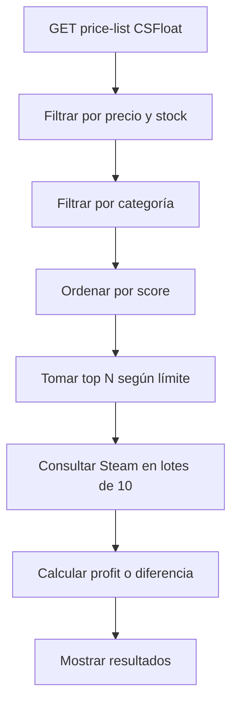

# 🏛️ SaintProfit — Arbitraje CS2 entre CSFloat y Steam Market

**SaintProfit** (v2.6.0) es una extensión de navegador (Brave/Chrome) que encuentra oportunidades de **arbitraje de precios** entre **CSFloat** y **Steam Market** para artículos de Counter-Strike 2 (CS2).

Compara precios de **skins, cuchillos, guantes, pegatinas, cajas, agentes, llaveros, parches, lotes de música, coleccionables y graffiti**, calculando el profit real descontando la comisión del 15% de Steam.

Incluye **2 modos de arbitraje**: **SteamFarm** (CSFloat → Steam para maximizar ganancias) y **Capitallet** (Steam → CSFloat para convertir saldo a wallet).

---

## 📋 Tabla de Contenidos

- [Características](#-características)
- [Capturas](#-capturas)
- [Estructura del Proyecto](#-estructura-del-proyecto)
- [Instalación](#-instalación)
- [Uso](#-uso)
- [Modos](#-modos)
- [Flujo de Escaneo](#-flujo-de-escaneo)
- [API y Fuentes de Datos](#-api-y-fuentes-de-datos)
- [Cálculo de Profit](#-cálculo-de-profit)
- [Historial de Búsquedas](#-historial-de-búsquedas)
- [Filtros](#-filtros)
- [Ordenamiento](#-ordenamiento)
- [Contador y Timer en Vivo](#-contador-y-timer-en-vivo)
- [Indicador ⭐ Conversión Ideal](#-indicador--conversión-ideal)
- [Filtro Más Vendidos](#-filtro-más-vendidos)
- [Click en Filas](#-click-en-filas)
- [Actualizaciones](#-actualizaciones)
- [Content Script (Badges en CSFloat)](#-content-script-badges-en-csfloat)
- [Solución de Problemas](#-solución-de-problemas)
- [Versiones](#-versiones)
- [Diseño](#-diseño)
- [Licencia](#-licencia)

---

## 🚀 Características

| Característica | Descripción |
|---|---|
| **Escaneo Inteligente** | Obtiene todos los items de CSFloat y los filtra antes de consultar Steam |
| **12 Categorías** | Skins, Cuchillos, Guantes, Pegatinas, Cajas, Agentes, Llaveros, Parches, Música, Coleccionables, Graffiti |
| **Profit Real** | Calcula ganancia descontando el 15% de comisión de Steam |
| **Modo Capitallet** | Modo inverso para convertir saldo Steam → Wallet CSFloat |
| **⭐ Conversión Ideal** | Estrella dorada cuando la diferencia es < 0.5% en Capitallet |
| **Filtro Más Vendidos** | Checkbox + columna de volumen en AMBOS modos |
| **Click en Filas** | Capitallet: click en fila → abre Steam. SteamFarm: click → abre CSFloat |
| **Filtros en Vivo** | Profit mínimo, rango de precio, categoría, orden — sin re-escanear |
| **Selector de Orden** | 9 opciones de ordenamiento para SteamFarm, 5 para Capitallet |
| **Contador + Timer** | 🔍 Items escaneados + ⏱️ tiempo transcurrido en tiempo real |
| **Historial Persistente** | Guarda resultados en localStorage con Top 7 por profit |
| **Top 7 Histórico** | Mejores oportunidades de todos los escaneos, visible en modo inactivo |
| **Auto-Restauración** | Al recargar la página se restaura el último escaneo automáticamente |
| **Detener Escaneo** | Botón para detener la búsqueda sin perder resultados parciales |
| **Tabla Ordenable** | Clic en cualquier columna de la tabla para ordenar ascendente/descendente |
| **Links Directos** | Iconos CSF → CSFloat y Steam → Steam Market por cada item |
| **Badges en CSFloat** | Content script que muestra badges de profit directamente en csfloat.com |
| **Auto-Update** | Sistema de actualización automática desde GitHub |
| **UI SaintProfit** | Paleta naranja + aqua · Glassmorphism · Animaciones · Diseño responsive |
| **Glow Dinámico** | Columna activa con glow naranja, inactiva con glow violeta |
| **Transiciones Suaves** | Animaciones de slide, fade, y pulse en todos los componentes |

---

## 📁 Estructura del Proyecto

```
saintprofit/
├── manifest.json           # Configuración de la extensión (Manifest V3)
├── app.html                # Página principal (SPA con CSS embebido + ~3000 líneas)
├── popup.html              # Popup minimalista con selector de modos
├── README.md               # Esta documentación
├── .gitignore              # Archivos ignorados por git
├── icons/
│   ├── icon16.png
│   ├── icon48.png
│   ├── icon128.png
│   ├── icon256.png         # Logo para el header de app.html
│   ├── brand-header.jpeg   # Lettering SaintProfit
│   ├── lettering.png       # Lettering grande
│   ├── lettering-small.png # Lettering para popup
│   ├── csfloat-link.png    # Icono de link a CSFloat
│   └── steam-link.webp     # Icono de link a Steam
├── css/
│   └── styles.css          # Estilos para badges en CSFloat
└── js/
    ├── app.js              # Lógica principal: UI, APIs, historial, renderizado (~950 líneas)
    ├── background.js        # Service worker: proxy Steam, auto-update
    ├── content.js           # Content script para badges en CSFloat
    ├── init.js              # Mode switching, Top 7 histórico
    ├── popup.js             # Lógica del popup
    └── loader.js            # Cargador de archivos actualizados
```

### 📄 Descripción de Archivos

| Archivo | Rol |
|---|---|
| **manifest.json** | Manifiesto MV3: permisos, host_permissions, CSP, content_scripts |
| **app.html** | Single-page application con CSS embebido y diseño grid de 3 columnas |
| **popup.html** | Popup minimalista con selector de modos (SteamFarm / Capitallet) |
| **js/app.js** | IIFE auto-ejecutable (~950 líneas): UI, CSFloat API, Steam API, historial, render |
| **js/init.js** | Mode switching (active/inactive), renderizado Top 7 histórico, event delegation |
| **js/background.js** | Service worker: proxy de Steam, detección de actualizaciones |
| **js/content.js** | Inyectado en csfloat.com: detecta listings y muestra badges de profit |
| **js/popup.js** | Abre app.html con el modo seleccionado vía query param |
| **css/styles.css** | Badges flotantes con animación para CSFloat |

---

## 🔧 Instalación

### Requisitos

- **Brave** o **Chrome** (versión actualizada)
- Conocimientos básicos de CSFloat y Steam Market

### Instalación Manual (Desarrollador)

1. **Descargá el proyecto**
   ```bash
   git clone https://github.com/marianojsc21/cs-arbitrage-extension.git
   cd cs-arbitrage-extension
   ```

2. **Cargá la extensión en Brave/Chrome**
   - Abrí `brave://extensions` o `chrome://extensions`
   - Activá **"Modo desarrollador"** (toggle superior derecho)
   - Clic en **"Cargar descomprimida"**
   - Seleccioná la carpeta del proyecto

3. **Listo** 🎉
   - Hacé clic en el icono 🏛️ de SaintProfit en la barra
   - Elegí un modo y comenzá a escanear

---

## 🎮 Uso

### Popup de la Extensión

1. Hacé clic en el icono de SaintProfit en la barra de herramientas
2. Elegí entre **SteamFarm** o **Capitallet**
3. Se abre la app en una nueva pestaña con el modo seleccionado

### SteamFarm (app.html?mode=profit)

1. **Configurá los filtros** en la columna izquierda: Categoría, Profit Mínimo, Rango CSFloat, Límite, Más Vendidos, Orden
2. Hacé clic en **"Escanear"**
3. Seguí el progreso en vivo: contador de items + timer ⏱️
4. Revisá los resultados en la tabla, ordená por cualquier columna
5. Hacé clic en una **fila** para abrir CSFloat, o en los iconos CSF/Steam
6. Usá el **Historial** 📋 para recuperar búsquedas anteriores

### Capitallet (app.html?mode=capitallet)

1. **Configurá los filtros**: Categoría, Precio Steam (min/max), Diferencia Máxima, Límite, Más Vendidos, Orden
2. Hacé clic en **"Escanear"**
3. Revisá las coincidencias — buscá items con ⭐ (ideal), 🟢 ganancia o 🔴 pérdida
4. Hacé clic en una **fila** para abrir Steam
5. Comprá en Steam, vendé en CSFloat para materializar tu saldo

### Cambio de Modo

Hacé clic en el título del modo ("SteamFarm" o "Capitallet") para intercambiarlos. El modo activo ocupa el espacio principal con glow naranja, y el inactivo se reduce a una columna angosta con stats, Top 7 histórico y glow violeta.

---

## 🔄 Modos

### 💵 SteamFarm
Busca la **máxima diferencia** de precio donde CSFloat es barato y Steam es caro:
- **Compra en**: CSFloat
- **Vende en**: Steam (con comisión del 15%)
- **Resultado**: Profit en Steam Wallet
- **Columnas**: Item | CSFloat | Steam (-15%) | Profit $ | Profit % | Vol. Steam | Stock
- **Score**: `quantity × (1 / min_price)` para priorizar items baratos con stock

### 💰 Capitallet
Busca la **mínima diferencia** de precio para convertir saldo Steam a CSFloat:
- **Compra en**: Steam (con saldo acumulado)
- **Vende en**: CSFloat
- **Resultado**: Saldo Steam → Wallet CSFloat
- **Columnas**: Item | Steam | CSFloat (-2%) | Dif. $ | Dif. % | Vol. Steam | Stock
- **Indicador visual**: ⭐ Ideal (< 0.5%), 🟢 Ganancia, 🔴 Pérdida

---

## 🔄 Flujo de Escaneo



### Detalles Técnicos

| Aspecto | Detalle |
|---|---|
| **CSFloat API** | Endpoint público `/api/v1/listings/price-list` — sin autenticación |
| **Steam API** | `steamcommunity.com/market/priceoverview/` con headers anti-bloqueo |
| **Rate Limiting** | Lotes de 10 items, 2 segundos entre lotes |
| **Cache** | Steam cache de 30 minutos para evitar consultas duplicadas |
| **Timer** | ⏱️ `setInterval` con formato `M:SS`, se limpia en todos los exit paths |
| **Detención** | `scanning = false` interrumpe el loop en el siguiente lote |
| **Persistencia** | Resultados guardados en `localStorage`, auto-restauración al recargar |
| **Seguridad .toFixed()** | Todos los renders tienen `|| 0` guard para evitar crashes con datos corruptos |

---

## 📡 API y Fuentes de Datos

### CSFloat API

```http
GET https://csfloat.com/api/v1/listings/price-list
```

Respuesta: Array de objetos con:
```json
{
  "market_hash_name": "AK-47 | Redline (Field-Tested)",
  "min_price": 1500,        // Precio mínimo en centavos USD
  "quantity": 42            // Cantidad en stock
}
```

### Steam Market API

```http
GET https://steamcommunity.com/market/priceoverview/
    ?appid=730
    &currency=1
    &market_hash_name={nombre}
```

Headers adicionales para evitar bloqueos:
```
Accept: application/json
User-Agent: Mozilla/5.0 (Windows NT 10.0; Win64; x64) AppleWebKit/537.36
Referer: https://steamcommunity.com/market/
Origin: https://steamcommunity.com
```

**Importante**: Solo se usa `lowest_price` (precio mínimo actual). NO se usa `median_price` (mediana histórica) porque para items de bajo volumen la mediana puede diferir mucho del precio real.

---

## 💰 Cálculo de Profit

### SteamFarm
```
steam_price_real = steam_lowest_price × 0.85   (descontando 15% comisión)
profit_usd = steam_price_real - csfloat_price
profit_percent = ((steam_price_real - csfloat_price) / csfloat_price) × 100
```

### Capitallet
```
csfloat_net = csfloat_price × 0.98   (descontando 2% comisión CSFloat)
diff_usd = csfloat_net - steam_price
diff_percent = ((csfloat_net - steam_price) / steam_price) × 100
```

### Ejemplo SteamFarm

| Item | CSFloat | Steam (bruto) | Steam (-15%) | Profit $ | Profit % |
|---|---|---|---|---|---|
| AK-47 Redline FT | $15.00 | $22.00 | $18.70 | +$3.70 | +24.7% |
| AWP Asiimov BS | $28.00 | $38.00 | $32.30 | +$4.30 | +15.4% |

### Ejemplo Capitallet

| Item | Steam | CSFloat (-2%) | Dif. $ | Dif. % | Indicador |
|---|---|---|---|---|---|
| AK-47 Redline FT | $18.12 | $18.50 | +$0.38 | +2.1% | 🟢 Ganancia |
| Gut Knife Safari WW | $113.00 | $114.20 | +$1.20 | +1.1% | ⭐ Ideal |
| AWP Sun in Leo | $2.80 | $2.75 | -$0.05 | -1.8% | 🔴 Pérdida |

### Categorías Detectadas Automáticamente

| Categoría | Palabras Clave |
|---|---|
| 🎯 Skins | (default) |
| 🔪 Cuchillos | knife, bayonet, karambit, m9, gut, falchion, ★ |
| 🧤 Guantes | gloves, wrap |
| 🏷️ Pegatinas | sticker |
| 📦 Cajas | case, capsule, package |
| 👤 Agentes | agent, operator |
| 🔑 Llaveros | keychain, charm |
| 🪡 Parches | patch |
| 🎵 Música | music kit |
| 🎖️ Coleccionables | collectible, medal, coin |
| 🎨 Graffiti | graffiti |

---

## 📋 Historial de Búsquedas

Cada escaneo se guarda automáticamente en **localStorage** con todos los datos necesarios para restauración.

### Datos Guardados por Entrada

| Campo | Descripción |
|---|---|
| `id` | Identificador único (timestamp + random) |
| `date` | Timestamp del escaneo |
| `label` | Fecha formateada local (es-AR) |
| `filters` | Categoría, Profit, Precios, Límite usados |
| `stats` | Total items, escaneados, profit promedio, mejor %, profit total |
| `topResults` | Top 7 items con mayor profit (nombre, precios, %) |
| `results` | Array completo de resultados para restauración |

### Funcionalidades

| Acción | Cómo |
|---|---|
| **Ver historial** | Clic en 📋 **Historial** en la barra de controles |
| **Restaurar escaneo** | Clic en cualquier entrada del historial |
| **Eliminar entrada** | Clic en ✕ en la entrada |
| **Borrar todo** | Clic en 🗑️ en el header del panel |
| **Auto-restauración** | Al recargar la página se restaura el último escaneo automáticamente |
| **Top 7 en el historial** | Cada entrada muestra inline sus mejores items |
| **Límite** | Máximo 20 entradas (las más viejas se descartan automáticamente) |

### Top 7 Histórico Global

En la columna del **modo inactivo** se muestra un **Top 7 global** que agrega los mejores items de TODOS los escaneos históricos (sin duplicados), ordenados por profit. Al hacer clic en un item, abre su página en CSFloat (modo SteamFarm) o Steam (modo Capitallet).

### Historial Separado por Modo

| Modo | Storage Key |
|---|---|
| SteamFarm | `saintprofit_history` |
| Capitallet | `saintprofit_cap_history` |

---

## 🎛️ Filtros

Los filtros están organizados en **2 tarjetas separadas** en la columna izquierda, una para cada modo. Funcionan **en vivo** sobre los resultados ya escaneados (sin re-escanear). Se guardan en localStorage entre sesiones.

### SteamFarm

| Filtro | Tipo | Default | Opciones |
|---|---|---|---|
| **Categoría** | Select | Todas | Skins, Cuchillos, Guantes, etc. (12 opciones) |
| **Profit Mínimo** | Número | 10% | 1–999% |
| **Precio CSFloat** | Número | $3 – $50 | Mín y máx (2 filas) |
| **Límite** | Select | 50 | 15 / 30 / 50 / 100 / 200 |
| **🔥 Más Vend.** | Checkbox | off | Solo items con volumen en Steam |
| **Orden** | Select | Profit % ↓ | 9 opciones |

### Capitallet

| Filtro | Tipo | Default | Opciones |
|---|---|---|---|
| **Categoría** | Select | Todas | 12 opciones |
| **Precio Steam** | Número | $3 – $125 | Mín y máx (2 filas) |
| **Dif. Máx.** | Número | 5% | 0–100% |
| **Límite** | Select | 50 | 15 / 30 / 50 / 100 / 200 |
| **🔥 Más Vend.** | Checkbox | off | Solo items con volumen en Steam |
| **Orden** | Select | Menor dif. | 5 opciones |

---

## 🔄 Ordenamiento

### SteamFarm — 9 Opciones de Orden

| Opción | Ordena por |
|---|---|
| ⬇ Profit % ↓ | Mayor profit porcentual primero (default) |
| ⬆ Profit % ↑ | Menor profit porcentual primero |
| ⬇ Profit $ ↓ | Mayor profit en dólares primero |
| ⬆ Profit $ ↑ | Menor profit en dólares primero |
| ⬆ CSFloat ↑ | Precio CSFloat más barato primero |
| ⬇ CSFloat ↓ | Precio CSFloat más caro primero |
| ⬇ Stock ↓ | Mayor stock primero |
| ⬆ Stock ↑ | Menor stock primero |
| 🔥 Más vendidos | Mayor volumen en Steam primero |

### Capitallet — 5 Opciones de Orden

| Opción | Ordena por |
|---|---|
| ⬆ Menor dif. | Menor diferencia porcentual (default) |
| ⬇ Mayor dif. | Mayor diferencia porcentual |
| ⬆ CSFloat ↑ | Precio CSFloat ascendente |
| ⬇ CSFloat ↓ | Precio CSFloat descendente |
| 🔥 Más vendidos | Mayor volumen en Steam primero |

Además, se puede hacer clic en cualquier **header de columna** de la tabla para ordenar ascendente/descendente con indicador visual (↑↓).

---

## ⏱️ Contador y Timer en Vivo

Durante el escaneo se muestran en tiempo real:

```
📊 Lote 3/5 | Verificando 10 items... (5 con profit)
████████████████░░░░░░░░░░░░░░░░░ 45%
🔍 Items escaneados: 30 / 50     ⏱️ 1:23
```

- **Contador**: Se actualiza después de cada lote de 10 items
- **Timer**: Arranca al presionar "Escanear" (incluye el tiempo de obtener la lista de CSFloat)
- **Formato**: `M:SS` con `setInterval` de 1 segundo
- **Limpieza**: El timer se detiene al completar, detener manualmente, o si hay error
- **Independiente**: Cada modo tiene su propio timer y contador

---

## ⭐ Indicador ⭐ Conversión Ideal

En el modo **Capitallet**, cuando la diferencia entre CSFloat (-2%) y Steam es **menor a 0.5%**, el badge de Dif. % se ilumina:

| Diferencia | Badge | Significado |
|---|---|---|
| **< 0.5%** | ⭐ **+0.3%** (oro + pulso) | **¡Conversión ideal!** — perdés casi nada |
| 0.5% – 1% | 🟢 **+0.8%** (verde) | Buena conversión |
| 1% – 3% | 🟡 **+2.1%** (amarillo) | Conversión aceptable |
| > 3% | 🟠 **+4.5%** (naranja) | Mucha pérdida |

Los items con ⭐ son los mejores candidatos para convertir saldo de Steam a CSFloat wallet.

---

## 🔥 Filtro Más Vendidos

Disponible en **ambos modos** (SteamFarm y Capitallet):

### Checkbox "Solo items con volumen"
- Cuando está activado, solo se muestran items que tienen **volumen de ventas en Steam** (> 0 ventas en 24h)
- Ideal para filtrar items sin liquidez

### Columna "Vol. Steam"
- Muestra el volumen de ventas en las últimas 24h
- Color **aqua** si hay volumen, **gris** si es 0 (se muestra `—`)
- Ordenable por click en el header

### Opción de orden "🔥 Más vendidos"
- Ordena los resultados por **mayor volumen primero**
- Útil para encontrar los items más líquidos

---

## 👆 Click en Filas

### Capitallet
Click en cualquier parte de una fila de resultados → abre **Steam Market** en una nueva pestaña. Los iconos CSF/Steam al final de la fila siguen funcionando independientemente.

### SteamFarm
Click en cualquier parte de una fila de resultados → abre **CSFloat** en una nueva pestaña.

### Top 7 Histórico
- **Modo SteamFarm activo**: click en un item del Top 7 → abre CSFloat
- **Modo Capitallet activo**: click en un item del Top 7 → abre Steam

---

## 🔄 Actualizaciones

El service worker (`js/background.js`) verifica actualizaciones cada hora desde GitHub:
```
https://raw.githubusercontent.com/marianojsc21/cs-arbitrage-extension/main/manifest.json
```

Si hay una versión más nueva, descarga los archivos actualizados y los almacena en `chrome.storage.local`.

### Archivos que se actualizan automáticamente:
- `js/app.js` · `js/content.js` · `js/popup.js` · `css/styles.css` · `popup.html` · `app.html`

---

## 🏷️ Content Script (Badges en CSFloat)

Cuando navegás en `csfloat.com` con la extensión activa:

1. **Detección de listings**: Encuentra elementos de listings en la página
2. **Consulta a Steam**: Obtiene precio de Steam vía background.js
3. **Cálculo de profit**: Misma fórmula (×0.85)
4. **Badge flotante**: Muestra CSFloat, Steam y Ganancia con color según %
   - 🟢 Aqua ≥30%
   - 🟡 Amarillo ≥20%
   - 🟠 Naranja ≥10%
   - 🔴 Rojo <10%
5. **Indicador global**: Badge "SaintProfit: ON / OFF" con dot animado
6. **Batch Processing**: Listings procesados en lotes de 5, con stagger de 300ms y 2.5s entre lotes

---

## 🔧 Solución de Problemas

### ❌ "No se encontraron listados en CSFloat"
**Causa**: CSFloat cambió su API o hay rate limiting.

**Solución**: 
1. Verificá que `https://csfloat.com` sea accesible
2. Esperá 30 segundos y reintentá

### ❌ Steam bloquea las consultas (429)
**Causa**: Demasiadas consultas a Steam Market en poco tiempo.

**Solución**: 
1. Bajá el límite de items a 15 o 30
2. Esperá 1 minuto entre escaneos
3. La extensión espera 2s entre lotes de 10 items

### ❌ "Extension context invalidated"
**Causa**: El service worker se recargó mientras el content script seguía activo.

**Solución**: Recargá la página de CSFloat. La extensión ahora maneja este error gracefulmente.

### ❌ Error CSP en consola
**Causa**: Una extensión de terceros o Brave intenta inyectar un script en la página de SaintProfit.

**Solución**: Es **inofensivo** — la extensión funciona correctamente de todos modos. Ignorar.

### ❌ "Cannot read properties of undefined (reading 'toFixed')"
**Causa**: Datos corruptos en el historial (escaneos de versiones anteriores).

**Solución**: Borrá el historial (🗑️) y escaneá de nuevo. Desde v2.6.0 todos los renders están protegidos con `|| 0`.

---

## 📌 Versiones

| Versión | Cambios |
|---|---|
| **v3.5.0** | 🗄️ **StorageHelper** — historial persistente con `chrome.storage.local` + `localStorage` (dual-write, sobrevive reinstalaciones) · 🎯 Border sólido 2px en columna activa (reemplaza box-shadow clipado) · 📐 Columna de filtros 340px con espaciado general refinado · 🔲 Bordes de filtros al 45% opacidad · 🧩 Modo Smart Invest + Market Sniper · ⚡ Optimización scroll vertical · 🎨 Tema Night/Amber actualizados |
| **v2.8.0** | 🧠 Smart Invest Engine v2 — Portfolio Optimizer con knapsack time-based · 🎯 Cross-Market Opportunity Engine con proveedores Steam/CSFloat · ⭐ Alertas Steam Sniper para cuchillos/guantes < $20 · 📊 Calculadora de capitalización compuesta |
| **v2.7.0** | 🎨 **Sistema de temas**: SaintProfit (default), Night (ultra-dark), Amber (cálido) · Selector de tema en el footer · Persistencia en localStorage · Toast de notificación al cambiar |
| **v2.6.0** | 🐛 `toFixed()` crash fix en ALL renders (17 llamadas protegidas) · Min price en Capitallet · README actualizado |
| **v2.5.0** | 🔥 Click en filas de Capitallet → abre Steam · ⭐ Indicador de conversión ideal · Más vendidos en SteamFarm · Columna Vol. Steam en ambos modos |
| **v2.4.0** | 🔥 Filtro "Más vendidos" para Capitallet · Columna Vol. Steam · Fix duplicado Dif. Máx. |
| **v2.3.0** | ✨ Filtro "Orden" (8 opciones SteamFarm, 4 Capitallet) · Contador 🔍 y Timer ⏱️ en tiempo real · Timer cleanup en todos los exit paths · Animación de entrada en filtros · Glow violeta para modo inactivo · Transiciones de 0.2s en columnas |
| **v2.2.0** | ✨ Dos tarjetas de filtros separadas · Híbrido labels/inputs · Bordes inferiores corregidos · Dashboard padding refinado |
| **v2.1.0** | ✨ Layout 3-columnas · Modo inactivo se achica · Top 7 histórico global · Diseño responsive · Brand header con lettering |
| **v2.0.0** | ✨ **Rebrand**: CSMuza → **SaintProfit** · Paleta naranja + aqua · Popup minimalista · README con changelog |
| **v1.12.0** | Popup simplificado con selector de modos · URL-based tab selection |
| **v1.11.0** | Batch processing en content.js (5x más rápido) |
| **v1.10.0** | Indicador visual 🟢/🔴 en Capitallet · Filas coloreadas |
| **v1.9.0** | Historial de Capitallet con persistencia propia |
| **v1.8.0** | Modo Capitallet como pestaña separada |
| **v1.7.2** | Links CSF/STM en tabla · CSP explícito |
| **v1.5.0** | Diseño renovado · Categorías · Historial · Auto-restauración |
| **v1.0.0** | Versión inicial |

---

## 🎨 Diseño

### Paleta de Colores

| Color | Hex | Uso |
|---|---|---|
| 🟠 **Naranja** | `#ff6b35` | Acento principal, botones, headers, glow activo (accent-1) |
| 🟠 **Naranja claro** | `#ff8c42` | Gradientes, timer (accent-2) |
| 🟢 **Aqua** | `#00d4aa` | Profit, contador, highlights (accent-3) |
| 🟣 **Violeta** | `#a855f7` | Glow del modo inactivo |
| ⚫ **Negro** | `#0a0a0a` | Fondo principal |
| ⚪ **Blanco** | `#f0f0f0` | Texto primario |
| 🔘 **Gris** | `#666–#999` | Textos secundarios, bordes, muted |
| ⭐ **Oro** | `#ffd700` | Badge de conversión ideal |

### Efectos Visuales

- **Glassmorphism**: `backdrop-filter: blur(8px)` en tarjetas
- **Gradientes**: Botones con gradiente naranja + glow
- **Glow dinámico**: Columna activa → naranja; inactiva → violeta
- **Animaciones**: `slideDown`, `fadeIn`, `rowIn`, `shimmer`, `dot-pulse`, `stat-pulse`, `starPulse`
- **Hover states**: Todos los elementos interactivos tienen transiciones suaves
- **Scrollbar**: Personalizada y sutil (6px, semi-transparente)
- **Fondo animado**: 3 gradientes radiales en posiciones fijas
- **Diseño responsive**: 3 breakpoints (full, ≤1100px, ≤700px)

### Fuente

- **Space Grotesk** vía Google Fonts — weights 300–700

---

## 📄 Licencia

Este proyecto es de uso personal y educativo. Los datos de CSFloat y Steam son propiedad de sus respectivos dueños.

---

<div align="center">
  <p>🏛️ Hecho con 🧡 para la comunidad CS2</p>
  <p>
    <a href="https://csfloat.com">CSFloat</a> ·
    <a href="https://steamcommunity.com/market">Steam Market</a>
  </p>
</div>
